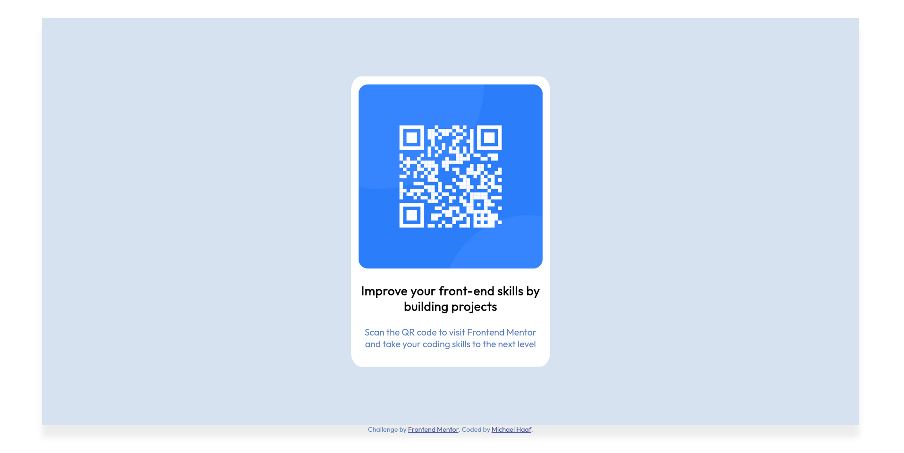

# Frontend Mentor - QR code component solution

This is a solution to the [QR code component challenge on Frontend Mentor](https://www.frontendmentor.io/challenges/qr-code-component-iux_sIO_H). 

## Table of contents

- [Overview](#overview)
  - [Screenshot](#screenshot)
  - [Links](#links)
- [My process](#my-process)
  - [Built with](#built-with)
  - [What I learned](#what-i-learned)

## Overview

### Screenshot

Mobile (less than 500px width) view:

Desktop view:

### Links

- [Solution URL](https://github.com/michaelhaaf/frontend-mentor/tree/main/qr-code-project)
- [Live Site URL](https://michaelhaaf.github.io/frontend-mentor/qr-code-project/)

## My process

### Built with

- Semantic HTML5 markup
- CSS custom properties
- Flexbox
- Mobile-first workflow using @media queries

### What I learned

How to create a basic frontend mentor project. My solution isn't very precise, I hope to learn soon how to make principled and accurate comparisons to a design (without being provided Figma or Sketch files).
